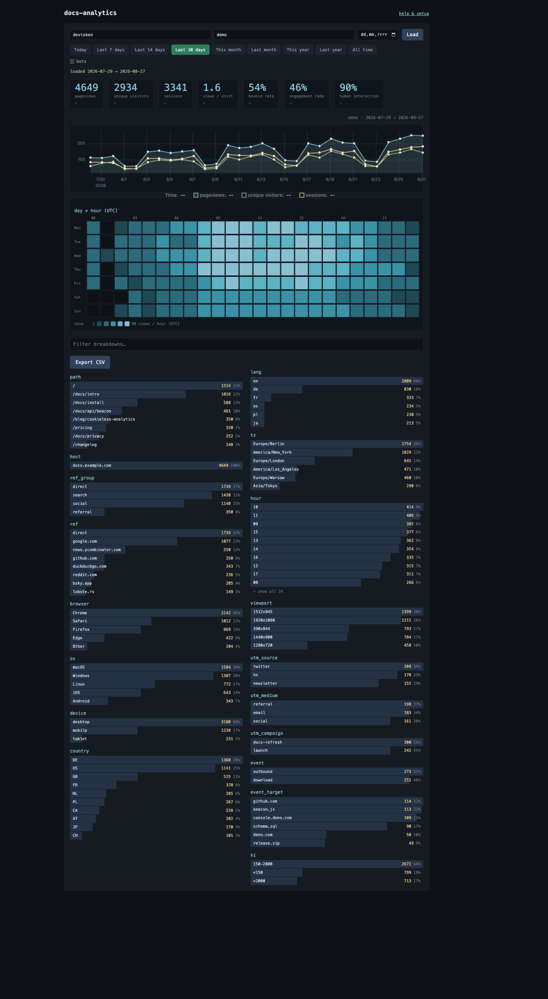
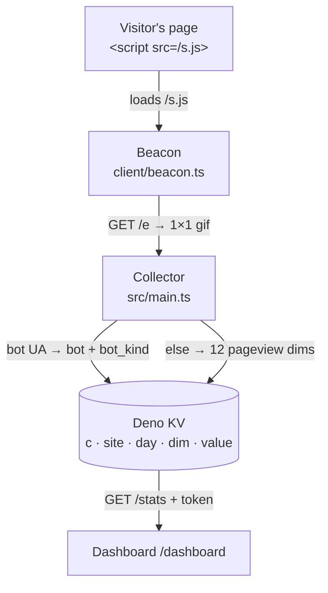

# deno-kv-analytics

[](https://lukasmega.github.io/deno-kv-analytics/badge)

Cookieless pageview collector on Deno KV. No cookies, no IP storage, no
fingerprint → **no consent banner**. Stores daily aggregate counts. Runs on the
**new** Deno Deploy ([`console.deno.com`](https://console.deno.com)).

**Deploy once, track many sites.** Every counter is keyed under a `site` segment
and a request maps to a site by its Host, so each site points its own
`stats.<their-domain>` at the same deployment. Adding a site is one env var.

Add one tag to a page and you are collecting:

```html
<script defer src="https://stats.example.com/s.js" data-site="acme"></script>
```

📖 **[Documentation](https://lukasmega.github.io/deno-kv-analytics/)** ·
[Quickstart](https://lukasmega.github.io/deno-kv-analytics/quickstart) ·
[Deploy](https://lukasmega.github.io/deno-kv-analytics/deploy) ·
[Design notes](https://lukasmega.github.io/deno-kv-analytics/design) ·
[Privacy](https://lukasmega.github.io/deno-kv-analytics/privacy)

## See it

```bash
deno task demo
```

The real handler over an in-memory KV seeded with 30 days of deterministic fake
traffic. No account, no database, nothing written to disk.



## Run it

```bash
deno task dev     # builds the beacon, then serves http://localhost:8123
```

Then open **http://localhost:8123/help** — token `devtoken`, site `demo`. That
page probes the live server on every step, and it is the same code that deploys.

## Deploy it

1. `console.deno.com` → **New App** → your fork. Entrypoint `src/main.ts`, build
   command **empty**. Not `deployctl` — that is Deploy Classic, shut down
   2026-07-20.
2. **Databases → Provision Database → Deno KV**, then **Assign** to the app.
   Easy to miss; without it every route 500s.
3. **Settings → Environment Variables**: `SITES` and `STATS_TOKEN`. That is the
   whole required set.
4. **Settings → Domains**: `stats.<yourdomain>` + the DNS record it shows.
5. Open `/help` on the deployment and run the checks.

Step by step, with links to the official Deno docs:
**[Getting started](https://lukasmega.github.io/deno-kv-analytics/deploy)**.

## Configure it

| env var                            | what                                                                                   |
| ---------------------------------- | -------------------------------------------------------------------------------------- |
| `SITES`                            | **required** — allowlist, `id[:host]` comma-separated, e.g. `acme:stats.acme.dev,blog` |
| `STATS_TOKEN`                      | **required** — admin token: reads any site, the only token allowed on `/sites`         |
| `STATS_TOKEN_<ID>`                 | per-site token (`my-site` → `STATS_TOKEN_MY_SITE`); reads only that site               |
| `BADGE_SITES`                      | site ids allowed a public README badge; unset → none                                   |
| `PORT` · `KV_PATH` · `LEGACY_SITE` | self-hosting, local KV file, migration bridge                                          |

Full semantics, Host→site resolution and the operator CLI:
**[Configuration](https://lukasmega.github.io/deno-kv-analytics/configuration)**.

## Badge it

```markdown

```

An SVG view counter for a README — the badge at the top of this file is this
collector counting its own docs site. Opt-in per site, one number, no token:
**[Badge](https://lukasmega.github.io/deno-kv-analytics/badge)**.

<details>
<summary><b>Tasks</b></summary>

```bash
deno task dev            # watch on :8123 (builds the beacon first)
deno task demo           # seeded UI, in-memory KV
deno task test           # main / sites / kv / e2e
deno task build-client   # src/client/beacon.ts -> src/s.js
deno task admin -- list | size | usage --site <id> | delete --site <id> --yes
```

`mise run test|lint|check|beforeCommit` wraps the same things; `beforeCommit` is
the CI job in one command. `mise run docs` / `docs-build` drive the Docusaurus
site in `website/`.

</details>

## How it works



A pageview writes 12 independent counters — no co-occurrence, so no cross-dim
segmentation, which is what keeps the no-consent claim true. Bots are counted,
not dropped. On the KV free tier that is ≈25K pageviews/month, shared across
every site on the deployment.

The schema, the write budget, the bot handling, the behavioral probe and the
Deno Deploy layout rules all have one home:
**[Design notes](https://lukasmega.github.io/deno-kv-analytics/design)**.

## Privacy

[docs/privacy-template.md](docs/privacy-template.md) is a visitor-facing privacy
note you can adapt for a site that uses this collector. It claims only what the
code actually does — keep the two in step if you extend the collector.

## License

MIT — see [LICENSE](LICENSE).
