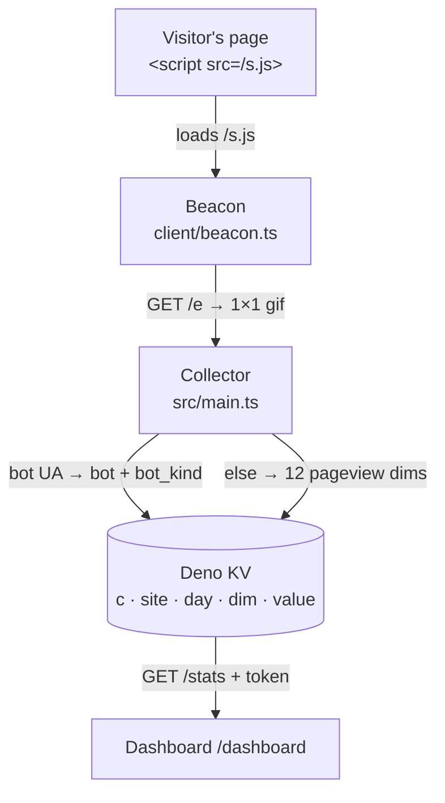

# deno-kv-analytics

Cookieless pageview collector on Deno KV. No cookies, no IP storage, no
fingerprint → **no consent banner**. Stores daily aggregate counts. Runs on the
**new** Deno Deploy ([`console.deno.com`](https://console.deno.com)).

Add one tag to a page and you are collecting:

```html
<script defer src="https://stats.example.com/s.js" data-site="acme"></script>
```

On a mapped custom domain, `data-site` is not needed — the collector resolves the
site from the request Host.

**Deploy once, track many sites.** Every counter is keyed under a `site` segment
and a request maps to a site by its Host, so each site points its own
`stats.<their-domain>` at the same deployment. Adding a site is one env var.

## Start here

- **[Quickstart](./quickstart.md)** — `deno task demo`, then the real thing
  locally. Two commands, no account.
- **[Getting started](./deploy.md)** — the whole deploy: create the app,
  provision Deno KV, set two env vars, map a domain.

## How it works



No cookie, no IP, no fingerprint is ever read or stored. The collector derives
browser and OS from the request `user-agent` server-side, increments one counter
per dimension, and returns the same 1×1 gif either way — including for a site it
cannot resolve, which writes nothing at all.

## What it stores

`key = ["c", site, day, dim, value]`, the value a counter. Dimensions are counted
**independently** — no co-occurrence, so no cross-dim segmentation. That is
exactly what keeps the no-consent claim true.

A pageview writes 12 dims: `pv`, `path`, `host`, `ref`, `ref_group`, `lang`,
`tz`, `browser`, `os`, `device`, `hour`, `dowhour`. Bot traffic is **counted, not
dropped** — it writes `bot`/`bot_kind` instead of `pv`.

On the Deno KV free tier that is roughly **25K pageviews/month**, shared across
every site on the deployment.

Full schema, every optional dim, the bot handling and the reasoning behind each:
**[Design notes](./design.md)**.

## What visitors see

Nothing. There is no banner, because there is nothing to consent to — see
[Privacy](./privacy.md), which is both this site's own privacy page and the
template to adapt for yours.
